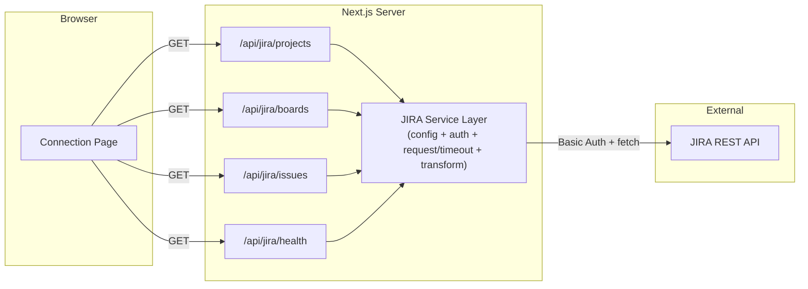

# Design Document: JIRA Connection (Phase 1)

## Overview

This design establishes the foundational layer of ProjectDashBoard: a Next.js App Router project with TypeScript and Tailwind CSS, a server-side JIRA API proxy that handles authentication and error mapping, and a connection verification page that displays raw JIRA data. The architecture prioritizes security (credentials never reach the client), clean separation (a reusable JIRA service layer), and extensibility (the proxy pattern supports future dashboard and MCP phases).

### Key Design Decisions

1. **Server-side proxy over direct client calls** — JIRA credentials stay in environment variables, never shipped to the browser. The proxy also centralizes timeout handling, error normalization, and future caching.
2. **Thin, framework-independent service layer** — A `lib/jira/` module encapsulates auth header construction, request execution, and response transformation. This layer is intentionally framework-independent so it can be reused by both Next.js API route handlers (Phase 1–3) and MCP Server tool implementations (Phase 4–5) without modification. API routes delegate to this layer, keeping route handlers minimal.
3. **Validation-first approach** — Every proxy route validates config and params before making external calls, failing fast with structured error responses. The `projectKey` parameter is validated against a strict pattern (`/^[A-Z][A-Z0-9_]{1,9}$/`) to prevent JQL injection.
4. **Fetch API with AbortController** — Uses the native `fetch` available in Next.js server runtime, with `AbortController` for the 10-second timeout. No external HTTP library needed.
5. **Sanitized error forwarding** — Upstream JIRA error responses are mapped to sanitized, predictable messages. Raw JIRA error details are logged server-side only, never forwarded to the client.
6. **Caching deferred to Phase 2** — Caching is intentionally deferred to Phase 2; the Phase 1 service interface should allow caching to be introduced without changing API route contracts. The service layer's return types and function signatures are designed with this in mind.
7. **Phase 1 display cap (50 issues)** — The 50-issue cap on the issues endpoint is a Phase 1 display cap only; pagination and complete retrieval will be addressed in Phase 2. This prevents the limit from being treated as a permanent architectural decision.
8. **Dedicated health endpoint** — A lightweight `/api/jira/health` endpoint verifies connectivity without piggybacking on heavier data-fetching routes.

## Architecture



### Data Flow

1. Browser loads Connection Page → component calls internal API routes
2. API route handler delegates to JIRA Service Layer
3. JIRA Service validates environment config (fails with 500 if invalid)
4. JIRA Service validates query params (fails with 400 if missing/invalid)
5. JIRA Service constructs auth header, makes request with 10s timeout
6. On success: transform JIRA response to slim payload, return JSON
7. On JIRA error: map to sanitized error message, log raw details server-side
8. On timeout/network error: return 502 with connectivity failure description

**Note:** The route handler's sole responsibility is to parse the incoming request and call the appropriate service function. All JIRA-specific concerns — config loading, authentication, request execution, timeout handling, response transformation, and error sanitization — are owned by the JIRA Service Layer.

## Components and Interfaces

### 1. JIRA Service Layer (`lib/jira/`)

This layer is intentionally framework-independent (no dependency on Next.js request/response types) so it can be consumed by both Next.js API route handlers and the Phase 4–5 MCP Server tool implementations. It owns all JIRA-specific concerns: configuration, authentication, request execution, timeout, transformation, and error mapping.

```typescript
// lib/jira/config.ts
interface JiraConfig {
  baseUrl: string;   // validated: starts with https://
  email: string;     // validated: non-empty
  apiToken: string;  // validated: non-empty
}

function validateConfig(): JiraConfig | { error: string };
```

```typescript
// lib/jira/client.ts
interface JiraClientOptions {
  config: JiraConfig;
  timeoutMs?: number; // default: 10000
}

interface JiraRequestResult<T> {
  data?: T;
  error?: { status: number; message: string };
}

function createAuthHeader(email: string, apiToken: string): string;
function jiraFetch<T>(path: string, options?: RequestInit): Promise<JiraRequestResult<T>>;
```

```typescript
// lib/jira/errors.ts
/**
 * Maps raw JIRA HTTP error responses to sanitized client-safe messages.
 * Raw JIRA error details are logged server-side only.
 */
interface SanitizedError {
  status: number;
  message: string;
}

function sanitizeJiraError(jiraStatus: number, rawMessage: string): SanitizedError;
```

```typescript
// lib/jira/validation.ts
/**
 * Validates projectKey against /^[A-Z][A-Z0-9_]{1,9}$/ to prevent JQL injection.
 * JIRA project keys: uppercase letters, digits, underscores, 2-10 characters.
 */
function isValidProjectKey(key: string): boolean;
```

```typescript
// lib/jira/types.ts
interface JiraProject {
  key: string;
  name: string;
}

interface JiraBoard {
  id: number;
  name: string;
  type: string; // "scrum" | "kanban"
}

interface JiraIssue {
  key: string;
  summary: string;
  status: string;
}

interface HealthStatus {
  status: "connected" | "disconnected";
  baseUrl?: string;
  error?: string;
}
```

### 2. API Route Handlers (`app/api/jira/`)

| Route | Method | Params | JIRA Endpoint | Response |
|-------|--------|--------|---------------|----------|
| `/api/jira/health` | GET | — | `GET /rest/api/3/myself` | `HealthStatus` |
| `/api/jira/projects` | GET | — | `GET /rest/api/3/project` | `JiraProject[]` |
| `/api/jira/boards` | GET | — | `GET /rest/agile/1.0/board` | `JiraBoard[]` |
| `/api/jira/issues` | GET | `projectKey` (required, validated: `/^[A-Z][A-Z0-9_]{1,9}$/`) | `GET /rest/api/3/search?jql=project={key}&maxResults=50` | `JiraIssue[]` |

Each route handler follows the same pattern:
1. Parse the incoming request (extract query params)
2. Delegate to JIRA Service Layer (which handles config validation, param validation, auth, request, transform, error mapping)
3. Return the service result as JSON with `Content-Type: application/json`

**Health endpoint specifics:**
- Makes a minimal JIRA API call (`GET /rest/api/3/myself`) to verify credentials and connectivity
- Returns `200` with `{ status: "connected", baseUrl: "..." }` on success
- Returns `503` with `{ status: "disconnected", error: "..." }` on failure
- Used by the connection status badge component

### 3. Sanitized Error Mapping

Instead of forwarding raw JIRA error messages (which may contain internal details like stack traces, internal URLs, or user data), the service layer maps JIRA errors to sanitized, predictable messages:

| JIRA Status | Returned Status | Client Message |
|-------------|-----------------|----------------|
| 401 | 401 | `"JIRA authentication failed"` |
| 403 | 403 | `"JIRA access denied"` |
| 404 | 404 | `"JIRA resource not found"` |
| 429 | 429 | `"JIRA rate limit exceeded"` |
| 5xx | 502 | `"JIRA service unavailable"` |

The raw upstream response (status, headers, body) is logged server-side at `warn` level for debugging. Client responses never include the raw JIRA error text.

### 4. Connection Page (`app/page.tsx`)

A single-page client component that:
- Renders a connection status badge (green/red) based on `/api/jira/health`
- Displays the configured JIRA base URL (returned from the health endpoint)
- Shows three data sections: Projects, Boards, Issues
- Issues section activates when a project is selected from the projects list
- Each section handles loading, error, and empty states independently

```typescript
// Component structure
ConnectionPage
├── StatusBadge          // "Checking..." | "Connected" | "Disconnected"
│                        // Calls GET /api/jira/health (not /projects)
├── ProjectsSection      // fetches on mount
│   ├── LoadingSkeleton
│   ├── ErrorDisplay
│   ├── EmptyState
│   └── ProjectList      // clickable rows to select project
├── BoardsSection        // fetches on mount
│   ├── LoadingSkeleton
│   ├── ErrorDisplay
│   ├── EmptyState
│   └── BoardList
└── IssuesSection        // fetches when project selected
    ├── SelectPrompt     // "Select a project to view issues"
    ├── LoadingSkeleton
    ├── ErrorDisplay
    ├── EmptyState
    └── IssueList
```

### 5. Environment Configuration

| Variable | Validation | Description |
|----------|-----------|-------------|
| `JIRA_BASE_URL` | Non-empty, starts with `https://` | Atlassian instance URL (e.g., `https://yourteam.atlassian.net`) |
| `JIRA_EMAIL` | Non-empty string | Atlassian account email |
| `JIRA_API_TOKEN` | Non-empty string | Atlassian API token |

## Data Models

### JIRA API Response Shapes (relevant subset)

```typescript
// GET /rest/api/3/myself response (used by health endpoint)
interface JiraApiMyself {
  accountId: string;
  emailAddress: string;
  displayName: string;
  active: boolean;
}

// GET /rest/api/3/project response (array of project objects)
interface JiraApiProject {
  id: string;
  key: string;
  name: string;
  projectTypeKey: string;
  // ... many other fields we discard
}

// GET /rest/agile/1.0/board response
interface JiraApiBoardResponse {
  maxResults: number;
  startAt: number;
  total: number;
  isLast: boolean;
  values: JiraApiBoard[];
}

interface JiraApiBoard {
  id: number;
  self: string;
  name: string;
  type: string;
  // ... location, other fields
}

// GET /rest/api/3/search response
interface JiraApiSearchResponse {
  startAt: number;
  maxResults: number;
  total: number;
  issues: JiraApiIssue[];
}

interface JiraApiIssue {
  id: string;
  key: string;
  self: string;
  fields: {
    summary: string;
    status: { name: string };
    // ... many other fields
  };
}
```

### Transformation Logic

| Source | Destination | Mapping |
|--------|-------------|---------|
| `JiraApiMyself` | `HealthStatus` | `{ status: "connected", baseUrl: config.baseUrl }` |
| `JiraApiProject` | `JiraProject` | `{ key, name }` |
| `JiraApiBoard` | `JiraBoard` | `{ id, name, type }` |
| `JiraApiIssue` | `JiraIssue` | `{ key, summary: fields.summary, status: fields.status.name }` |

## Correctness Properties

*A property is a characteristic or behavior that should hold true across all valid executions of a system — essentially, a formal statement about what the system should do. Properties serve as the bridge between human-readable specifications and machine-verifiable correctness guarantees.*

### Property 1: Config validation correctness

*For any* combination of environment variable values (JIRA_BASE_URL, JIRA_EMAIL, JIRA_API_TOKEN), the validation function SHALL return a valid config if and only if JIRA_BASE_URL starts with "https://", JIRA_EMAIL is non-empty, and JIRA_API_TOKEN is non-empty; otherwise it SHALL return an error naming the first invalid variable.

**Validates: Requirements 2.1, 2.4**

### Property 2: Auth header construction

*For any* non-empty email string and non-empty API token string, the `createAuthHeader` function SHALL produce a string equal to `"Basic " + base64(email + ":" + token)`, and decoding the base64 portion SHALL yield the original email and token separated by a colon.

**Validates: Requirements 3.4**

### Property 3: Issue response capping

*For any* mock JIRA search response containing N issues (where N ≥ 0), the issues transformation function SHALL return at most 50 issues, and each returned issue SHALL contain exactly the `key`, `summary`, and `status` fields extracted from the source.

**Validates: Requirements 3.3**

### Property 4: Sanitized error mapping

*For any* HTTP error status code returned by the JIRA API, the proxy SHALL return the appropriate mapped status code (401→401, 403→403, 404→404, 429→429, 5xx→502) with a sanitized message string that does not contain the raw JIRA response body, and the raw JIRA error SHALL be logged server-side only.

**Validates: Requirements 3.6**

### Property 5: Missing or invalid parameter validation

*For any* request to `/api/jira/issues` where the `projectKey` query parameter is absent, empty, or does not match the pattern `/^[A-Z][A-Z0-9_]{1,9}$/`, the proxy SHALL return HTTP 400 with a JSON body containing an `error` field that describes the validation failure.

**Validates: Requirements 3.8**

### Property 6: Data rendering completeness

*For any* non-empty array of JIRA entities (projects, boards, or issues), the corresponding rendering component SHALL produce output that contains every entity's required display fields (project: key + name; board: name + type; issue: key + summary + status).

**Validates: Requirements 4.2, 5.2, 6.2**

### Property 7: Error message display

*For any* sanitized error message string returned by any API proxy route, the corresponding section on the Connection Page SHALL render that error message text within a visually distinct error container.

**Validates: Requirements 4.4, 5.4, 6.4**

## Error Handling

### Error Response Schema

All error responses from the API proxy follow a consistent shape:

```typescript
interface ApiError {
  error: string; // sanitized, human-readable description
}
```

### Error Matrix

| Condition | HTTP Status | Client Error Message |
|-----------|-------------|----------------------|
| Missing/empty env var | 500 | `"Server configuration error: {VAR_NAME} is missing or empty"` |
| Missing query param | 400 | `"Missing required parameter: projectKey"` |
| Invalid projectKey format | 400 | `"Invalid projectKey: must match /^[A-Z][A-Z0-9_]{1,9}$/"` |
| JIRA returns 401 | 401 | `"JIRA authentication failed"` |
| JIRA returns 403 | 403 | `"JIRA access denied"` |
| JIRA returns 404 | 404 | `"JIRA resource not found"` |
| JIRA returns 429 | 429 | `"JIRA rate limit exceeded"` |
| JIRA returns 5xx | 502 | `"JIRA service unavailable"` |
| JIRA unreachable / timeout | 502 | `"Unable to connect to JIRA: request timed out"` |
| Unexpected server error | 500 | `"Internal server error"` |

Raw JIRA error details (response body, headers) are logged server-side at `warn` level for debugging. They are never included in client responses.

### Client-Side Error Handling

- Each data section independently catches and displays errors
- Errors are shown in a red-bordered container with the sanitized error text
- A failed section does not prevent other sections from loading
- The connection status badge reflects only the `/api/jira/health` result

### Timeout Strategy

- JIRA requests use `AbortController` with a 10-second signal
- On abort, the catch block identifies `AbortError` and returns 502
- The health-check on the Connection Page also applies a 10-second client-side timeout

## Testing Strategy

### Unit Tests (Vitest)

Focus on the JIRA service layer — pure functions with clear inputs/outputs:

| Test Target | What's Verified |
|-------------|-----------------|
| `validateConfig()` | Correct acceptance/rejection of env var combinations |
| `createAuthHeader()` | Correct base64 encoding of email:token |
| Issue transformation | Correct field extraction and 50-item cap |
| `sanitizeJiraError()` | Correct status mapping and message sanitization |
| `isValidProjectKey()` | Accepts valid keys, rejects invalid/injection attempts |
| Param validation | 400 responses for missing/invalid params |
| Health endpoint | Correct connected/disconnected responses |

### Property-Based Tests (fast-check)

Library: **[fast-check](https://github.com/dubzzz/fast-check)** for TypeScript property-based testing.

Configuration:
- Minimum 100 iterations per property
- Each test tagged with its design property reference

| Property | Generator Strategy |
|----------|-------------------|
| Property 1: Config validation | Arbitrary strings for URL/email/token, including empty strings, whitespace, non-https URLs |
| Property 2: Auth header | Arbitrary non-empty strings for email and token (excluding colon edge cases handled by base64) |
| Property 3: Issue capping | Arrays of 0–200 mock issue objects |
| Property 4: Sanitized error mapping | Integer in 400–599 range + arbitrary non-empty string for raw JIRA message; verify client never sees raw message |
| Property 5: Missing/invalid param | Arbitrary query string objects with projectKey absent, empty, or containing invalid characters (lowercase, special chars, too long, too short) |
| Property 6: Data rendering | Arrays of 1–20 entity objects with random string fields |
| Property 7: Error display | Arbitrary sanitized error message strings |

Tag format: `// Feature: jira-connection, Property {N}: {title}`

### Integration Tests

- Mock JIRA API using MSW (Mock Service Worker) or similar
- Test full request→response cycle through API routes
- Verify headers, status codes, and response shapes end-to-end
- Verify `/api/jira/health` returns correct connected/disconnected status
- Verify sanitized error responses do not leak raw JIRA details

### Smoke Tests

- Verify project scaffolding (file existence checks)
- Verify `npm install`, `npm run build` exit cleanly
- Verify `.env.local` is gitignored
- Verify no credentials leak into client bundles

### Test Runner

- **Vitest** — fast, TypeScript-native, compatible with Next.js
- Configuration in `vitest.config.ts` at project root
- Separate test directories: `__tests__/unit/`, `__tests__/integration/`

## Future Phase Compatibility

This section documents how the Phase 1 service layer is designed to support future phases without rework.

### Phase 4–5: MCP Server Integration

- Phase 4–5 will introduce an MCP Server exposing JIRA tools (`get_projects`, `get_boards`, `search_issues`, `get_sprint_status`, `get_assignee_workload`)
- These MCP tools will reuse the same JIRA service layer (`lib/jira/`) defined in Phase 1
- The MCP Server will **NOT** duplicate JIRA authentication, request handling, transformation, or caching logic
- The service interface is designed to be transport-agnostic: it works identically when called from HTTP route handlers or MCP tool handlers

### Architectural Guarantee

```
Phase 1–3: API Route Handler → JIRA Service Layer → JIRA REST API
Phase 4–5: MCP Tool Handler  → JIRA Service Layer → JIRA REST API
```

The JIRA Service Layer (`lib/jira/`) accepts plain parameters and returns plain result objects. It has no dependency on:
- Next.js `Request`/`Response` types
- MCP protocol types
- Any transport-specific abstractions

This ensures the same service functions can be called from any transport layer without adaptation.

### Phase 2 Caching Path

When caching is introduced in Phase 2, it will be added as a middleware within the JIRA Service Layer (e.g., wrapping `jiraFetch`). Because API route handlers only interact with the service's public interface (`getProjects()`, `getBoards()`, `searchIssues()`), caching can be introduced transparently without changing route handler code or response contracts.
